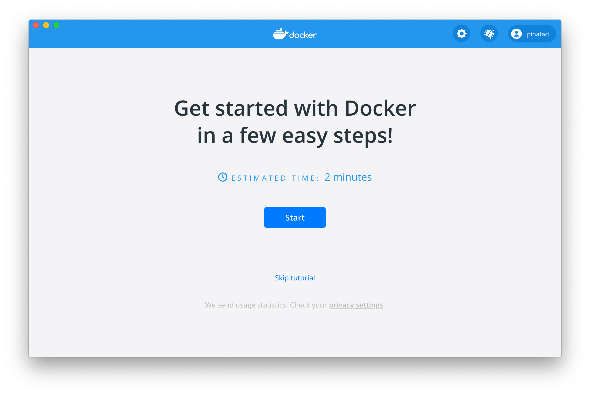

> **Update to the Docker Desktop terms**
>
> Professional use of Docker Desktop in large organizations (more than 250 employees or more than $10 million in annual revenue) requires users to have a paid Docker subscription. While the effective date of these terms is August 31, 2021, there is a grace period until January 31, 2022, for those that require a paid subscription. For more information, see the blog [Docker is Updating and Extending Our Product Subscriptions](https://www.docker.com/blog/updating-product-subscriptions/){: target="_blank" rel="noopener" class="_" id="dkr_docs_cta"} and the [Docker Desktop License Agreement](../../subscription/index.md#docker-desktop-license-agreement).
{: .important}

Welcome to Docker Desktop for Mac. This page contains information about Docker Desktop for Mac system requirements, download URLs, instructions to install and update Docker Desktop for Mac.

> Download Docker Desktop for Mac
>
> [Mac with Intel chip](https://desktop.docker.com/mac/main/amd64/Docker.dmg?utm_source=docker&utm_medium=webreferral&utm_campaign=docs-driven-download-mac-amd64){: .button .primary-btn }
> [Mac with Apple chip](https://desktop.docker.com/mac/main/arm64/Docker.dmg?utm_source=docker&utm_medium=webreferral&utm_campaign=docs-driven-download-mac-arm64){: .button .primary-btn }

## System requirements

Your Mac must meet the following requirements to install Docker Desktop successfully.

<ul class="nav nav-tabs">
<li class="active"><a data-toggle="tab" data-target="#mac-intel">Mac with Intel chip</a></li>
<li><a data-toggle="tab" data-target="#mac-apple-silicon">Mac with Apple silicon</a></li>
</ul>
<div class="tab-content">
<div id="mac-intel" class="tab-pane fade in active" markdown="1">

### Mac with Intel chip

- **macOS must be version 10.15 or newer**. That is, Catalina, Big Sur, or Monterey. We recommend upgrading to the latest version of macOS.

  If you experience any issues after upgrading your macOS to version 10.15, you must install the latest version of Docker Desktop to be compatible with this version of macOS.

  > **Note**
  >
  > Docker supports Docker Desktop on the most recent versions of macOS. That is, the current release of macOS and the previous two releases. As new major versions of macOS are made generally available, Docker stops supporting the oldest version and supports the newest version of macOS (in addition to the previous two releases). Docker Desktop currently supports macOS Catalina, macOS Big Sur, and macOS Monterey.

- At least 4 GB of RAM.

- VirtualBox prior to version 4.3.30 must not be installed as it is not compatible with Docker Desktop.

</div>
<div id="mac-apple-silicon" class="tab-pane fade" markdown="1">

### Mac with Apple silicon

- You must install **Rosetta 2** as some binaries are still Darwin/AMD64. To install Rosetta 2 manually from the command line, run the following command:

  ```console
  $ softwareupdate --install-rosetta
  ```

 For more information, see [Docker Desktop for Apple silicon](apple-silicon.md).

</div>
</div>

## Install and run Docker Desktop on Mac

1. Double-click `Docker.dmg` to open the installer, then drag the Docker icon to
    the Applications folder.

      

2. Double-click `Docker.app` in the Applications folder to start Docker. In the example below, the Applications folder is in "grid" view mode.

    

3. The Docker menu ({: .inline}) displays the Docker Subscription Service Agreement window. It includes a change to the terms of use for Docker Desktop.

    

4. Click the checkbox to indicate that you accept the updated terms and then click **Accept** to continue. Docker Desktop starts after you accept the terms.

    > **Important**
    >
    > If you do not agree to the terms, the Docker Desktop application will close and  you can no longer run Docker Desktop on your machine. You can choose to accept the terms at a later date by opening Docker Desktop.
    {: .important}

    For more information, see [Docker Desktop License Agreement](../../subscription/index.md#docker-desktop-license-agreement). We recommend that you also read the [Blog](https://www.docker.com/blog/updating-product-subscriptions/){: target="_blank" rel="noopener" class="_" id="dkr_docs_desktop_install_btl"} and [FAQs](https://www.docker.com/pricing/faq){: target="_blank" rel="noopener" class="_" id="dkr_docs_desktop_install_btl"} to learn how companies using Docker Desktop may be affected.

### Quick start guide  
  
  If you've just installed the app, Docker Desktop launches the Quick Start Guide. The tutorial includes a simple exercise to build an example Docker image, run it as a container, push and save the image to Docker Hub.

   

Congratulations! You are now successfully running Docker Desktop. Click the Docker menu ({: .inline}) to see
**Preferences** and other options. To run the Quick Start Guide on demand, select the Docker menu and then choose **Quick Start Guide**.

## Updates



## Uninstall Docker Desktop

To uninstall Docker Desktop from your Mac:

1. From the Docker menu, select **Troubleshoot** and then select **Uninstall**.
2. Click **Uninstall** to confirm your selection.

> **Note**
>
> Uninstalling Docker Desktop destroys Docker containers, images, volumes, and
> other Docker related data local to the machine, and removes the files generated
> by the application. Refer to the [back up and restore data](../backup-and-restore.md)
> section to learn how to preserve important data before uninstalling.

## Where to go next

- [Getting started](index.md) provides an overview of Docker Desktop on Mac, basic Docker command examples, how to get help or give feedback, and links to other topics about Docker Desktop on Mac.
- [Docker Desktop for Apple silicon](apple-silicon.md) for detailed information about Docker Desktop for Apple silicon.
- [Troubleshooting](troubleshoot.md) describes common problems, workarounds, how
  to run and submit diagnostics, and submit issues.
- [FAQs](../faqs.md) provide answers to frequently asked questions.
- [Release notes](release-notes/index.md) lists component updates, new features, and improvements associated with Docker Desktop releases.
- [Get started with Docker](../../get-started/index.md) provides a general Docker tutorial.
* [Back up and restore data](../backup-and-restore.md) provides instructions
  on backing up and restoring data related to Docker.
