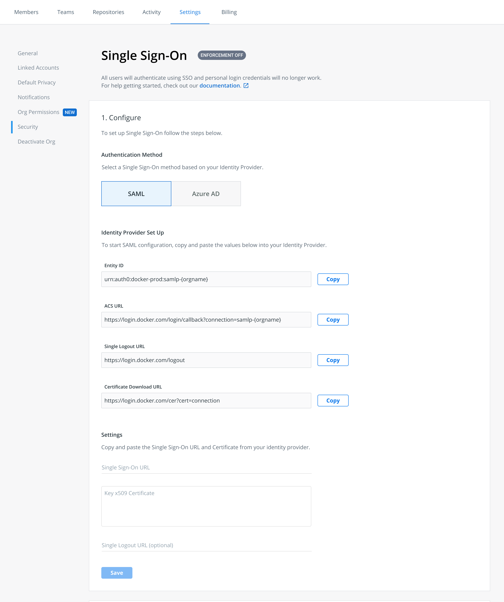
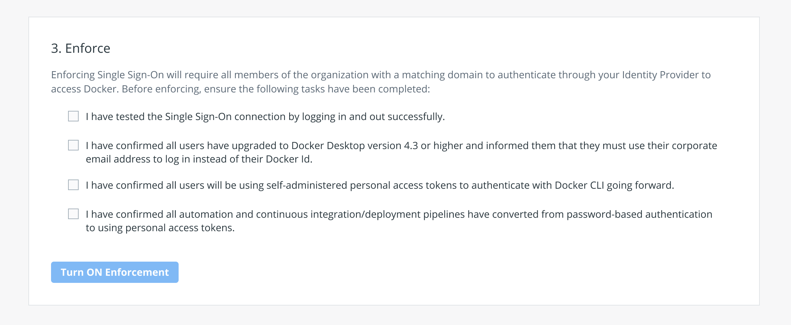

> **Update to Single Sign-on**
>
>Single Sign-on (SSO) will be available for General Availability (GA) starting mid-January 2022.
{: .important}

Docker Single Sign-on (SSO) allows users to authenticate using their identity providers (IdPs) to access Docker. Docker currently supports SAML 2.0 and Azure AD IdPs through Auth0. You can enable SSO on organization's that are part of the Docker Business subscription. To upgrade your existing account to a Docker Business subscription, see [Upgrade your subscription](../subscription/upgrade/){:target="blank" rel="noopener" class=""}.

When SSO is enabled, users are redirected to your provider’s authentication page to authenticate using SSO. They cannot authenticate using their personal login credentials (Docker ID and password).

Before enabling SSO in Docker Hub, administrators must work with their identity provider to configure their IdP to work with Docker Hub. Docker provides the Assertion Consumer Service (ACS) URL and the Entity ID. Administrators use this information to establish a connection between their IdP server and Docker Hub.

After establishing the connection between the IdP server and Docker Hub, administrators log into the organization in Docker Hub and complete the SSO enablement process. See the section Enable SSO in Docker Hub for detailed instructions.

To enable SSO in Docker Hub, you need the following:

* **SAML 2.0**: Entity ID, ACS URL, Single Logout URL and Certificate Download URL
* **Azure AD**: Client ID (a unique identifier for your registered AD application), Client Secret (a string used to gain access to your registered Azure AD application), and AD Domain details

We currently support enabling SSO on a single organization. If you have any users in your organization with a different domain (including social domains), they will be added to the organization as guests.

## SSO prerequisites

* You must first notify your company about the new SSO login procedures. Some of your users may want to maintain a different account for their personal projects.
* Verify that your org members have Docker Desktop version 4.4.0 installed on their machines.
* Each org member must [create a Personal Access Token] (PAT)  to replace their passwords.
* Confirm that all CI/CD pipelines have replaced their passwords with PATs.
* Test SSO using your domain email address and IdP password to successfully log in and log out of Docker Hub.

## Creating a Personal Access Token (PAT)

Before you configure SSO for your organization, each member of your organization must [create an access token](../docker-hub/access-tokens). There is currently a grace period, which will expire in the near future. Before enforcing the usage of PATs, your users will be able to log in from Docker Desktop CLI using their previous credentials during this transition period.
In addition, all email addresses should be added to your IdP.

## Configure SSO

To configure SSO, log into [Docker Hub](https://hub.docker.com){: target="_blank" rel="noopener" class="_"} to obtain the **ACS URL** and **Entity IDs** to complete the IdP server configuration process. You can only configure SSO with a single IdP.  When this is complete, log back into [Docker Hub](https://hub.docker.com){: target="_blank" rel="noopener" class="_"} and complete the SSO enablement process.

### Identity provider configuration

1. Log into [Docker Hub](https://hub.docker.com){: target="_blank" rel="noopener" class="_"} as an administrator and navigate to Organizations and select the organization that you want to enable SSO on.
2. Click **Settings** and select the Security tab.
3. Select an authentication method based on your identity provider. Docker currently supports **SAML 2.0** and **Azure AD**.
4. Copy the ID and/or URL in the **Identity Provider Set Up**.
    For SAML 2.0, copy the **Entity ID** and **ACS URL**. For Azure AD, copy your **Redirect URL/Reply URL**.
5. Log into your IdP to complete the IdP server configuration process. Refer to your IdP documentation for detailed instructions.
6. Complete the fields in the **Configuration Settings** section and click **Save**. If you want to change your IdP, you must delete your existing provider and configure SSO with your new IdP.

{:width="500px"}

### Domain control

Click Add Domain and specify the corporate domain you’d like to manage with SSO. Domains should be formatted without protocol or www information, for example, yourcompany.com.

> **Note**
   >
   > This should include all email domains and sub-domains users will use to access Docker.
   > Public domains are not permitted, such as gmail.com, outlook.com, etc.
   > Also, the email domain should be set as the primary email.

## Domain verfication

To verify ownership of a domain, add a TXT record to your Domain Name System (DNS) settings.

1. Copy the provided TXT record value and navigate to your DNS host and locate the **Settings** page to add a new record.
2. Select the option to add a new record and paste the TXT record value into the applicable field. For example, the **Value**, **Answer** or **Description** field.

    Your DNS record may have the following fields:
    * Record type: enter your 'TXT' record value
    * Name/Host/Alias: leave the default (@ or blank)
    * Time to live (TTL): enter **86400**

3. After you have updated the fields, click **Save**.

    Note: It can take up to 72 hours for DNS changes to take effect,  depending on your DNS host. The Domains table will have an Unverified status during this time.
4. In the Security section of your Docker organization, click **Verify** next to the domain you want to verify after 72 hours.

### Test your SSO configuration

After you’ve completed the SSO configuration process in Docker Hub, you can test the configuration when you log into Docker Hub using an incognito browser. Login using your domain email address and IdP password.  You will then get redirected to your identity provider’s login page to authenticate.

1. Authenticate via email instead of using your Docker ID, and test the login process.
2. To authenticate via CLI, your users must have a PAT before you enforce SSO for CLI users.

## Enforce SSO in Docker Hub

Before you enforce SSO in Docker Hub, you must complete the following:
Test SSO by logging in and out successfully, confirm that all members in your org have upgraded to Docker Desktop version 4.4.0, PATs are created for each member, CI/CD passwords are converted to PAT.

Admins can force users to authenticate with Docker Desktop by provisioning a registry.json configuration file. The registry.json file will force users to authenticate as a user that is configured in the allowedOrgs list in the registry.json file. For info on how to configure a registry.json file see Configure registry.json.

1. On the Single Sign-On page in Docker Hub, click **Turn ON Enforcement** to enable your SSO.
2. When SSO is enforced, your members are unable to modify their email address and password, convert a user account to an organization, or set up 2FA through Docker Hub. You must enable 2FA through your IdP.
    Note: If you want to turn off SSO and revert back to Docker’s built-in authentication, click **Turn OFF Enforcement**. Your members aren’t forced to authenticate through your IdP and can log into Docker using their personal credentials.

    {:width="500px"}

## Managing users when SSO is enabled

To add a member to your organization:
1. Create an account for your members in your IdP.
2. Add and invite your members to your organization.
    Note: when the first-time user logs into Docker using their domain email address, they are then added to your organization.

To add a guest to your organization in Docker Hub if they aren’t verified through your IdP:

1. Go to **Organizations** in Docker Hub, and select your organization.
2. Click **Add Member**, enter the email address, and select a team from the drop-down list.
3. Click **Add** to confirm.

## Remove members from the SSO organization

To remove a member from an organization:

1. Log into Docker Hub as an administrator of your organization.
Select the organization from the list. The organization page displays a list of members.
2. Click the **x** next to a member’s name to remove them from all the teams in the organization.
3. Click **Remove** to confirm. The member will receive an email notification confirming the removal.
    Note: when you remove a member from an SSO organization, they are unable to log in using their email address.

## FAQs
To learn more see our [FAQs](faqs.md).
