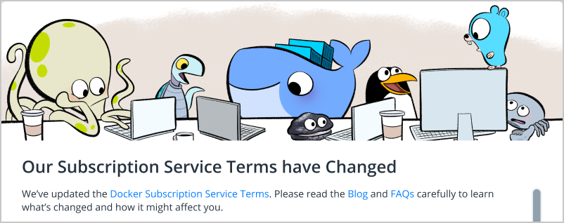

On August 31, 2021, we [announced](https://www.docker.com/blog/updating-product-subscriptions/){: target="_blank" rel="noopener" class="_"} updates and extensions to our product subscriptions to increase productivity, collaboration, and added security for our developers. Docker subscription tiers now include Personal, Pro, Team, and Business.

Here's a summary of the changes:

- We’re introducing a new product subscription, Docker Business, for large enterprises that require features like registry restrictions, SSO, secure software supply chain management, and more.
- Our Docker Subscription Service Terms include a change to the terms of use for Docker Desktop.
    - It remains free for small businesses (fewer than 250 employees AND less than $1 million in annual revenue), personal use, education, and non-commercial open source projects.
    - It requires a paid subscription (Pro, Team, or Business), for as little as $5 a month, for professional use in larger enterprises. 
    - The effective date of these terms is 31 August 2021. There is a grace period until 31 January 2022 for those that will require a paid subscription to use Docker Desktop.
- The Docker Pro and Docker Team subscriptions now include commercial use of Docker Desktop.
- The existing Docker Free subscription has been renamed Docker Personal. 
- No changes to Docker Engine or any other upstream open source Docker or Moby project.

To understand how these changes affect you, read the [Docker subscription FAQs](https://www.docker.com/pricing/faq){: target="_blank" rel="noopener" class="_"}.

To compare features available in each subscription, see the [Docker Pricing](https://www.docker.com/pricing/){: target="_blank" rel="noopener" class="_"} page.

## Docker Personal

Docker Personal is the new name for the Docker Free subscription. With its focus on the open source communities, individual developers, education, and small businesses, Docker Personal will continue to allow free use of Docker components - including the Docker CLI, Docker Compose, Docker Engine, Docker Desktop, Docker Hub, Kubernetes, Docker Build and Docker BuildKit, Docker Official Images, Docker Scan, and more.

Docker Personal includes unlimited public repositories and unlimited collaborators for public repositories and zero service accounts for private repositories at no cost per month.

For a list of features available in each tier, see [Docker Pricing](https://www.docker.com/pricing/){: target="_blank" rel="noopener" class="_"}.

## Docker Pro

**Docker Pro** enables individual developers to get more control of their development environment and provides an integrated and reliable developer experience. It includes unlimited public repositories, unlimited private repositories, unlimited [collaborators](../docker-hub/repos.md#collaborators-and-their-role) for public repositories, one [service account](../docker-hub/service-accounts.md) for private repositories, autobuilds with 5 parallel builds, starting at $5 per month with the annual subscription.

> **Note**
>
> Docker Pro tiers allow one service account for private repositories. For more information, see [service accounts](../docker-hub/service-accounts.md). If you already have more than one collaborator in your private repository, you’ll not be able to add any further collaborators. Any new private repository that you create will be restricted to one service account.

For a list of features available in each tier, see [Docker Pricing](https://www.docker.com/pricing/){: target="_blank" rel="noopener" class="_"}.

## Docker Team

The **Docker Team** tier includes unlimited public and unlimited private repositories starting at $25 per month for the first 5 users and $7 per month for each user thereafter with the annual subscription. In addition, the Team tier offers autobuilds with 15 parallel builds, advanced collaboration and management tools, including organization and team management with role-based access controls for the whole team.

For a list of features available in each tier, see [Docker Pricing](https://www.docker.com/pricing/){: target="_blank" rel="noopener" class="_"}.

## Docker Business

The new Docker Business subscription enables organization-wide management and security for businesses that use Docker at scale. With an easy-to-use SaaS-based management plane, IT leaders can now efficiently monitor and manage all their Docker environments and accelerate their secure software supply chain initiatives. 

In addition to all the capabilities available in the Pro and Team tiers, Docker Business tier adds the ability to control what registries and content developers can access, ensuring teams are building secure from the start by only pulling trusted base images. 

For a list of features available in each tier, see [Docker Pricing](https://www.docker.com/pricing/){: target="_blank" rel="noopener" class="_"}.

## Docker Desktop license terms

Docker Desktop is licensed under the [Docker Subscription Service Terms](https://www.docker.com/legal/docker-terms-service){: target="_blank" rel="noopener" class="_"}. When downloading and installing Docker Desktop, you will be asked to agree to the terms of service.

{:width="700px"}

Here's a summary of the key changes:

- Docker Desktop remains free for small businesses (fewer than 250 employees AND less than $1 million in revenue), personal use, education, and non-commercial open source projects.  
- It requires a paid subscription for professional use in larger enterprises.
The effective date of these terms is 31 August 2021. There is a grace period until 31 January 2022 for those that will require a paid subscription to use Docker Desktop. 
- The Docker Pro, Team, and Business subscriptions include commercial use of Docker Desktop

You can also find a copy of the Docker Subscription Service Terms from the Docker menu. Select {: .inline} > **About Docker Desktop** > **Subscription Service Terms**.

Docker Desktop is built using open source software. For information about the licensing of open source components in Docker Desktop, Select {: .inline} > **About Docker Desktop** > **Acknowledgements**.

> **Note**
>
> The licensing and distribution terms for Docker and Moby open source projects such as Docker Engine are not changing.

For information on how to subscribe, see [Upgrade your subscription](../subscription/upgrade.md), or to learn more about the features available in each tier, see [Docker Pricing](https://www.docker.com/pricing){: target="_blank" rel="noopener" class="_"}.

For frequently asked questions about pricing, see [Docker subscription FAQs](https://www.docker.com/pricing/faq){: target="_blank" rel="noopener" class="_"}.
